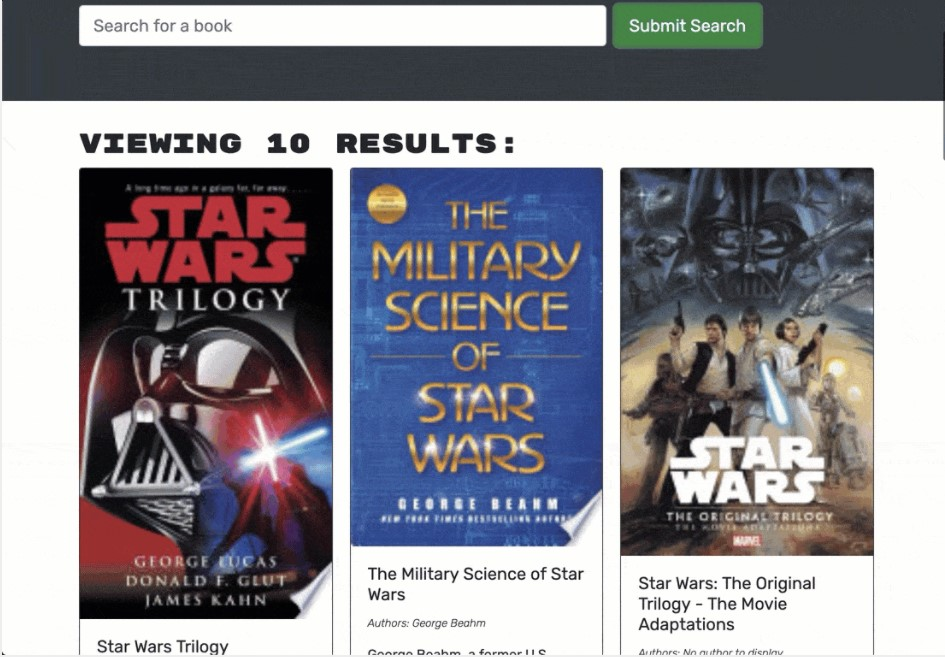

# Book-Search-Engine

## Description
This is a book search engine application that allows a user to login or sign up with an email and password.  You can then search for a book which returns an image of the front page of a book, the author, a summary as well as an option to save the book for later viewing.

## Table of Contents

[Description](#description)

[Study-Material](#Study-Material)

[Features](#features)

[Links](#links)

## Study-Material

[Express Routing](https://expressjs.com/en/guide/routing.html)

[GraphQL](https://graphql.org/learn/)

[Apollo Server Express](https://www.npmjs.com/package/apollo-server-express)

[Apollo Authentication](https://www.apollographql.com/docs/apollo-server/security/authentication/)

[Apollo graphQL Resolvers](https://www.apollographql.com/docs/apollo-server/data/resolvers/)

[Apollo graphQL typeDefs](https://www.apollographql.com/docs/react/local-state/client-side-schema/)

## Features

This app was built using HTML 3, CSS 6, Javascript, Apollo Server Express, graphQL, webToken,

## Links

[Repository](https://github.com/jmoniz155/book-search-engine)

[Live Website](https://jmoniz155.github.io/book-search-engine/)

## Author

`Jesse Moniz: UCSD coding student in San Diego, CA`

| Name          | Email                 | Github                        | Linkedin                                              |
| ------------- | --------------------- | ----------------------------- | ----------------------------------------------------- |
| Jesse Moniz   | Jmoniz155@gmail.com   | https://github.com/jmoniz155  | https://www.linkedin.com/in/jesse-moniz-98693621a/    |